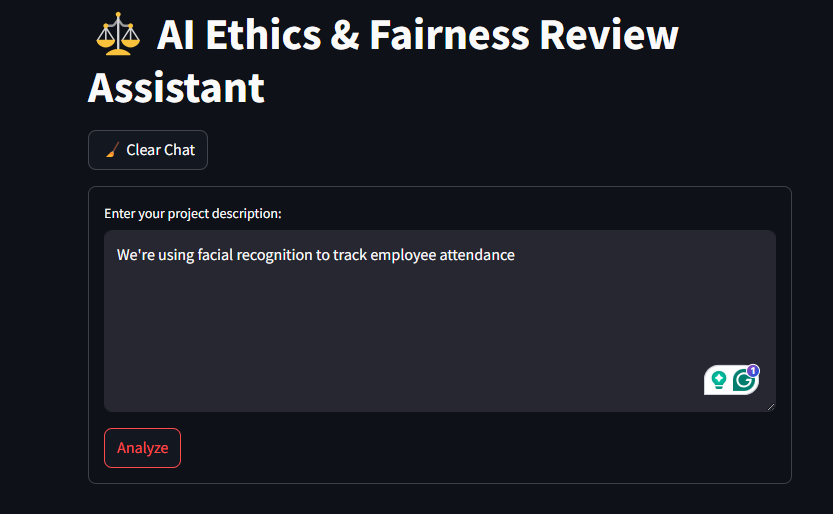
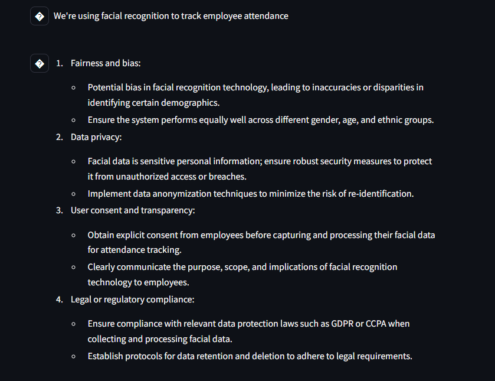

# ⚖️ AI Ethics & Fairness Review Assistant


> A GPT-powered assistant that provides ethical guidance for AI, data, or tech projects. Analyze risks, identify biases, and improve compliance with just a short project description.

---

## 📌 Features

- 🔍 Real-time GPT-3.5 Turbo integration
- 🧠 Structured, actionable ethical reviews
- 💬 Chat-style interface with memory
- 🎨 Spinner and throttle control for UX
- 📁 Markdown formatting for clean output
- 🧹 Clear chat with one click

---


## 📸 Screenshots

### 1. User enters a project description


### 2. Assistant provides ethical and fairness analysis


---

## 🚀 How to Run Locally

### 1. Clone the Repository

```bash
git clone https://github.com/your-username/ethics-assistant.git
cd ethics-assistant
```

### 2. Setup Python Environment

```bash
conda create -n ethicsbot python=3.10
conda activate ethicsbot
pip install -r requirements.txt
```

### 3. Add Your OpenAI API Key

Create a `.env` file:

```env
OPENAI_API_KEY=sk-xxxxxx...
```

### 4. Run the App

```bash
streamlit run ui/streamlit_ui.py
```

---

## 🌐 Live Demo (Optional)

> [Click here to try it on Streamlit Cloud](https://your-streamlit-app-url.streamlit.app)

---

## 🔐 Security & Secrets

- API keys are stored in `.env` (gitignored)
- No secrets are exposed in logs or UI
- Rate-limited by default to prevent abuse

---

## 🧱 Project Structure

```bash
ethics-assistant/
├── app/
│   ├── __init__.py
│   └── ethics_bot.py
├── test/
│   └── test_ethics_bot.py
├── ui/
│   └── streamlit_ui.py
├── assets/
│   ├── input_ui.png
│   └── output_response.png
├── .env                  # Not pushed to GitHub (added to .gitignore)
├── .gitignore
├── LICENSE
├── README.md
├── requirements.txt
```

---

## 🧠 Example Prompts

- "We're using facial recognition to track employee attendance."
- "Our model recommends loans based on historical customer data."
- "The chatbot provides personalized fitness advice to users."

---

## 👨‍💼 Author

**Sachin Bhandary**  
*AI Engineer*  
GitHub: [@sashjack0](https://github.com/sashjack0)

---

## 📄 License

[MIT License](LICENSE)


