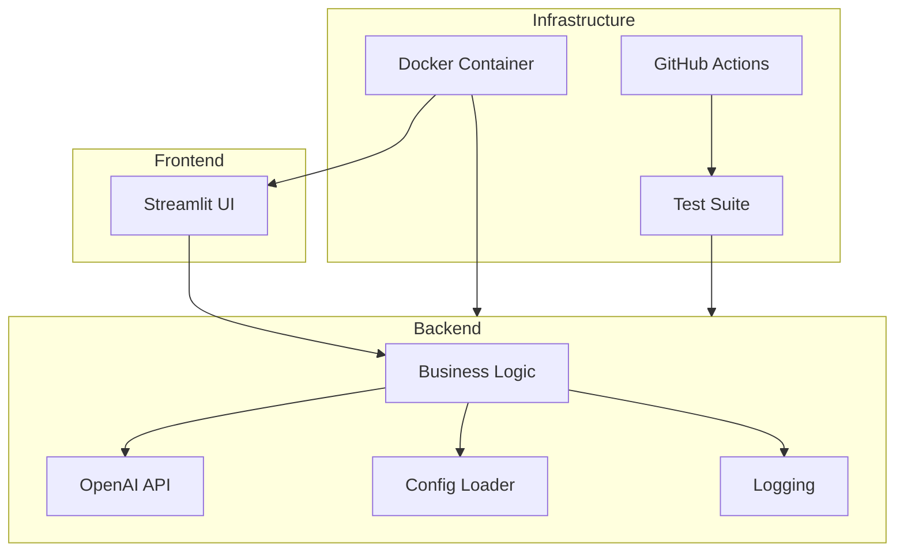

# ⚖️ AI Ethics & Fairness Review Assistant


A production-grade GPT-powered assistant that provides ethical guidance for AI, data, or tech projects. Analyze risks, identify biases, and improve compliance with just a short project description.

## 📋 Features

- 🔍 Real-time GPT-3.5 Turbo integration
- 🧠 Structured, actionable ethical reviews
- 💬 Chat-style interface with memory
- 🎨 Modern UI with Streamlit
- 🔒 Secure API key handling
- 📊 Comprehensive logging
- 🧪 Full test coverage
- 🐳 Docker support
- 🔄 Environment-based configuration
- ⚡ Rate limiting and throttling

## 🛠 Tech Stack

- **Frontend**: Streamlit
- **Backend**: Python 3.10+
- **AI/ML**: OpenAI GPT-3.5 Turbo
- **Testing**: pytest, pytest-mock
- **Linting**: black, isort, flake8, mypy
- **Containerization**: Docker, Docker Compose
- **CI/CD**: GitHub Actions
- **Configuration**: pydantic-settings, python-dotenv
- **Logging**: Python logging

## 🚀 Quick Start

### Local Development

1. **Clone the repository**
   ```bash
   git clone https://github.com/your-username/ethics-assistant.git
   cd ethics-assistant
   ```

2. **Set up Python environment**
   ```bash
   python -m venv venv
   source venv/bin/activate  # On Windows: venv\Scripts\activate
   pip install -r requirements.txt
   pip install -e ".[dev]"
   ```

3. **Configure environment**
   ```bash
   cp .env.example .env.local
   # Edit .env.local with your OpenAI API key
   ```

4. **Run the application**
   ```bash
   streamlit run ui/streamlit_ui.py
   ```

### Docker Setup

1. **Build and run with Docker Compose**
   ```bash
   docker-compose up app
   ```

2. **Run tests**
   ```bash
   docker-compose up test
   ```

3. **Run linting**
   ```bash
   docker-compose up lint
   ```

## 📝 Usage

1. Enter your project description in the text area
2. Click "Analyze" to get ethical insights
3. Review the structured analysis
4. Use the "Clear Chat" button to start over

### Example Prompts

- "We're using facial recognition to track employee attendance."
- "Our model recommends loans based on historical customer data."
- "The chatbot provides personalized fitness advice to users."

## 🧪 Testing

### Running Tests

```bash
# Run all tests
pytest

# Run with coverage
pytest --cov=app

# Run specific test file
pytest test/test_ethics_bot.py
```

### Running Linters

```bash
# Format code
black .
isort .

# Check code quality
flake8 .
mypy app test
```

## 🔄 Environment Configuration

The application supports multiple environments:

- **Local**: `.env.local` (default)
- **Staging**: `.env.staging`
- **Production**: `.env.production`

To switch environments:

```bash
# Local development
ENV=local streamlit run ui/streamlit_ui.py

# Staging
ENV=staging streamlit run ui/streamlit_ui.py

# Production
ENV=production streamlit run ui/streamlit_ui.py
```

## 🤝 Contributing

1. Fork the repository
2. Create a feature branch
3. Make your changes
4. Run tests and linting
5. Submit a pull request

### Development Workflow

```bash
# Install development dependencies
pip install -e ".[dev]"

# Run tests
pytest

# Format code
black .
isort .

# Check code quality
flake8 .
mypy app test
```

## 📊 Architecture


```mermaid
graph TD
    subgraph Frontend
        UI[Streamlit UI]
    end

    subgraph Backend
        BL[Business Logic]
        API[OpenAI API]
        Config[Config Loader]
        Logger[Logging]
    end

    subgraph Infrastructure
        Docker[Docker Container]
        CI[GitHub Actions]
        Tests[Test Suite]
    end

    UI --> BL
    BL --> API
    BL --> Config
    BL --> Logger
    Docker --> UI
    Docker --> Backend
    CI --> Tests
    Tests --> Backend
```

## 📄 License

This project is licensed under the MIT License - see the [LICENSE](LICENSE) file for details.

## 👨‍💼 Author

**Sachin Bhandary**  
*AI Engineer*  
GitHub: [@sashjack0](https://github.com/sashjack0)

## The Problem
AI systems are increasingly deployed in critical domains, but ethical considerations often come as an afterthought. Organizations struggle to:
- Identify potential biases in their AI systems
- Ensure compliance with regulations (GDPR, CCPA)
- Maintain transparency and fairness
- Document ethical considerations

## The Solution
A real-time AI ethics review assistant that:
- Analyzes project descriptions for ethical implications
- Provides structured, actionable insights
- Highlights potential risks and compliance issues
- Offers best practices for ethical AI development

## Why It Matters
- **Prevention**: Catch ethical issues early in development
- **Compliance**: Ensure regulatory requirements are met
- **Transparency**: Document ethical considerations
- **Education**: Help teams understand AI ethics
- **Risk Mitigation**: Reduce potential legal and reputational risks

## Technical Highlights
- **Modern Stack**: Python 3.10, Streamlit, OpenAI GPT-3.5
- **Production Ready**: Docker, CI/CD, comprehensive testing
- **Best Practices**: Type hints, logging, error handling
- **Scalable**: Containerized, stateless design
- **Secure**: Environment-based config, rate limiting

## Quick Start
```bash
# Clone and setup
git clone https://github.com/your-username/ethics-assistant.git
cd ethics-assistant

# Run with Docker
docker-compose up app

# Or run locally
python -m venv venv
source venv/bin/activate
pip install -r requirements.txt
streamlit run ui/streamlit_ui.py
```

## Future Roadmap
- User authentication and multi-tenant support
- Custom analysis templates
- Integration with popular AI platforms
- API for automated ethical reviews
- Team collaboration features


