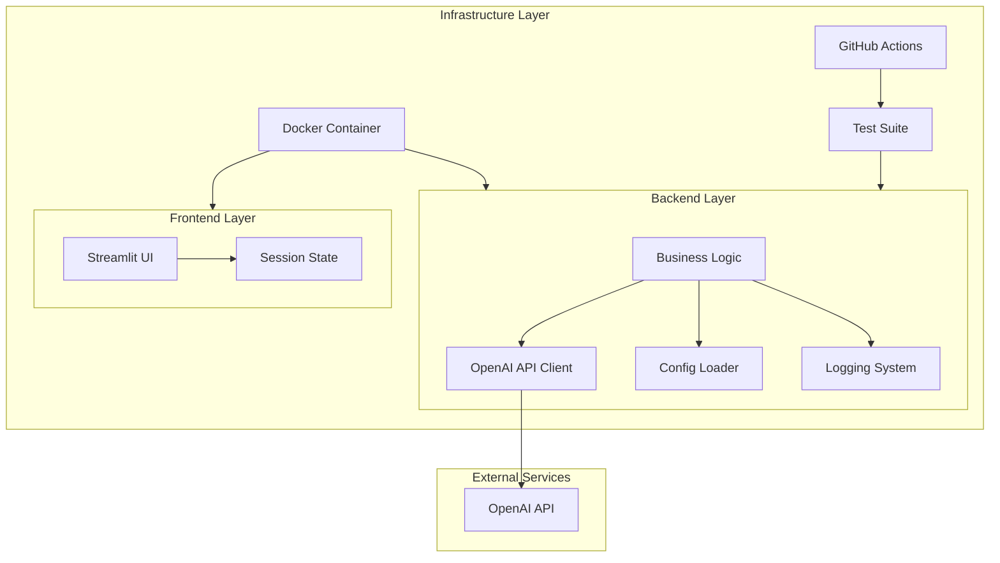
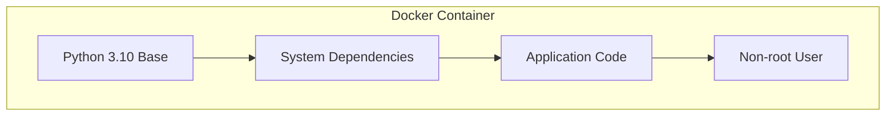
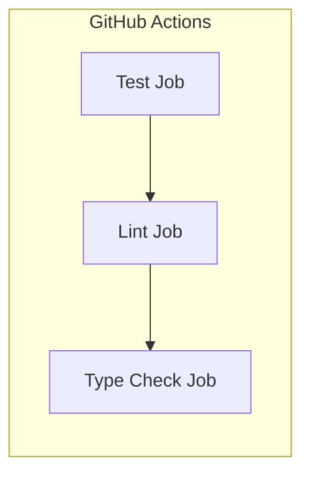
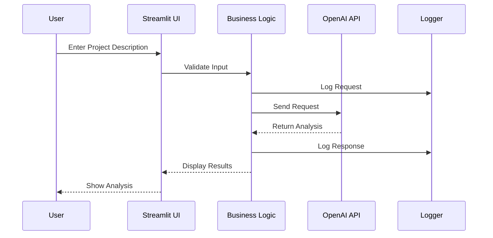
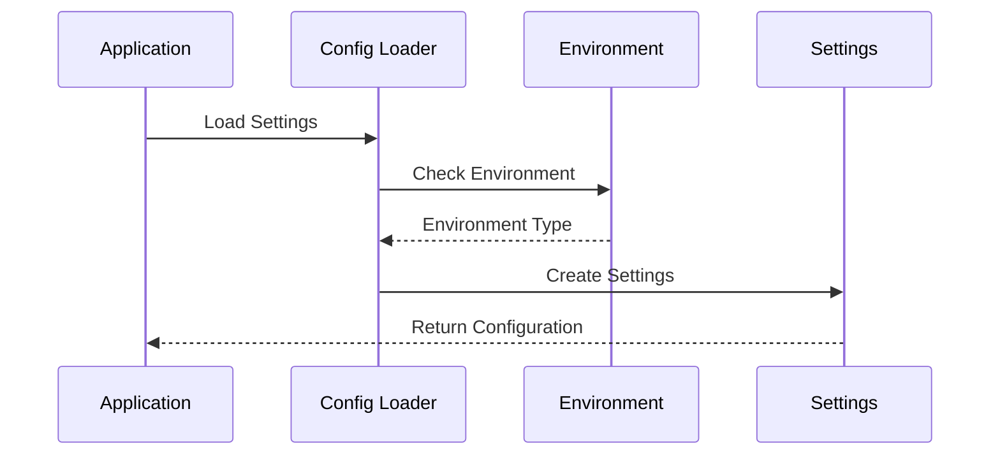
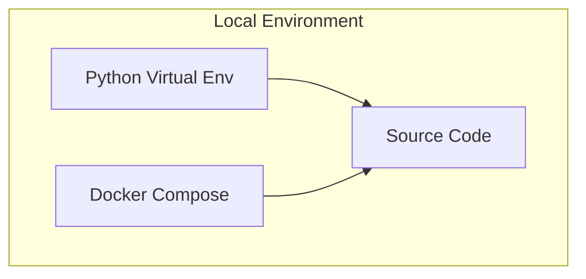
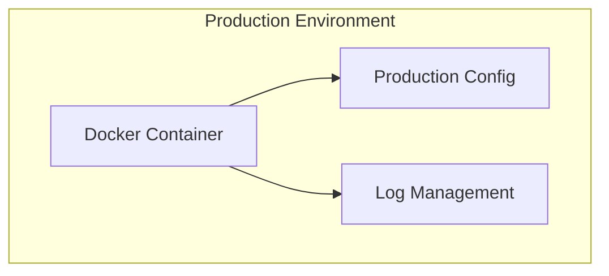

# Architecture Documentation

## System Overview

The Ethics Assistant is built with a modular, containerized architecture that emphasizes maintainability, testability, and scalability. This document outlines the system's architecture, component interactions, and deployment considerations.

## Component Architecture

## Component Details

### 1. Frontend Layer

#### Streamlit UI (`ui/streamlit_ui.py`)
- Handles user interaction
- Manages session state
- Implements rate limiting
- Provides real-time feedback

#### Session State
- Maintains chat history
- Manages user input
- Controls rate limiting

### 2. Backend Layer

#### Business Logic (`app/ethics_bot.py`)
- Processes user input
- Manages API interactions
- Implements validation
- Handles error cases

#### Configuration (`app/config/settings.py`)
- Environment management
- API configuration
- Application settings
- Logging configuration

#### Logging System
- Structured logging
- Environment-aware
- Configurable levels
- File and console output

### 3. Infrastructure Layer

#### Docker Container

#### CI/CD Pipeline

## Data Flow

1. **User Input Flow**

2. **Configuration Flow**

## Deployment Architecture

### Local Development

### Production Deployment

## Security Considerations

1. **API Security**
   - API keys stored in environment variables
   - No hardcoded secrets
   - Rate limiting implementation

2. **Container Security**
   - Non-root user
   - Minimal base image
   - Regular security updates

3. **Data Security**
   - No sensitive data storage
   - Input validation
   - Error handling

## Monitoring and Logging

1. **Logging Levels**
   - DEBUG: Development details
   - INFO: Normal operations
   - WARNING: Potential issues
   - ERROR: Operation failures

2. **Health Checks**
   - Container health monitoring
   - API endpoint availability
   - Resource usage tracking

## Scalability Considerations

1. **Horizontal Scaling**
   - Stateless design
   - Container orchestration ready
   - Load balancing support

2. **Resource Management**
   - Memory usage optimization
   - Connection pooling
   - Rate limiting

## Future Improvements

1. **Planned Enhancements**
   - User authentication
   - API versioning
   - Caching layer
   - Metrics collection

2. **Potential Optimizations**
   - Async operations
   - Response caching
   - Batch processing

   